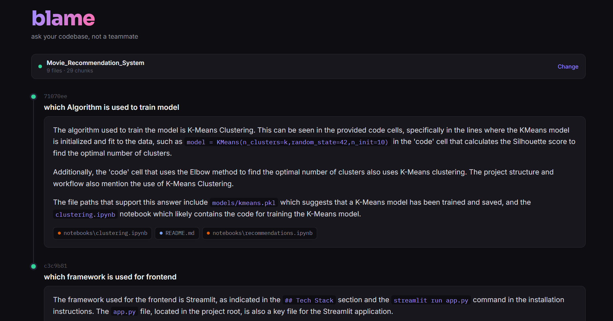

# blame — ask your codebase, not a teammate

A Retrieval-Augmented Generation (RAG) system that lets you paste any public GitHub repo and ask natural-language questions about its code — with grounded answers and real file citations, not guesses.

Built from scratch: no LangChain retrieval chains, no managed vector-DB SDK magic — every layer (chunking, embedding, vector search, retrieval, prompting) is implemented and understood end-to-end.



---

## Why this exists

Every developer has opened an unfamiliar repo and wished they could just ask "where does auth happen?" instead of grepping through files. This tool does that: point it at a repo, and it answers questions the way a teammate who already knows the codebase would — with the receipts (file paths) to back it up.

## How it works

```
GitHub URL
    │
    ▼
Clone repo (GitPython)
    │
    ▼
Load code files (60+ languages/formats, extension + filename matching)
    │
    ▼
Chunk (language-aware — won't cut a function in half)
    │
    ▼
Embed (local sentence-transformers, no external API for embeddings)
    │
    ▼
Store in Supabase (Postgres + pgvector), tagged by session
    │
    ▼
Query → embed question → cosine similarity search → top-k relevant chunks
    │
    ▼
Groq (Llama 3.3 70B) synthesizes a grounded answer from retrieved code
    │
    ▼
Answer + file citations, rendered in a git-log-style conversation timeline
```

## Features

- **Paste any public repo, get an indexed knowledge base in seconds** — no manual setup per repo
- **Language-aware chunking** — uses AST-informed split rules per language (Python, JS, Java, Go, Rust, and more) so functions and classes aren't cut mid-body, unlike naive character-count chunking
- **Broad file coverage** — 30+ extensions plus filename-based matching for extensionless files (`Dockerfile`, `Makefile`, `.gitignore`), including Jupyter notebooks (code cells only, outputs stripped)
- **Anti-hallucination prompting** — the model is explicitly instructed to say "I don't know" rather than infer facts from unrelated boilerplate (e.g. mistaking a devcontainer config for the project name)
- **Deduplication** — re-indexing the same repo doesn't create duplicate chunks
- **Session-isolated multi-user storage** — safe for multiple people to use the same deployed instance concurrently without their indexed repos colliding
- **File citations on every answer** — know exactly which files the model actually looked at

## Tech stack

| Layer | Choice | Why |
|---|---|---|
| Repo ingestion | GitPython | Clone repos programmatically |
| Chunking | LangChain text splitters (language-aware) | Respects code structure, not just character counts |
| Embeddings | `sentence-transformers` (all-MiniLM-L6-v2), local | Free, fast, no external API dependency for this step |
| Vector storage | Supabase (Postgres + pgvector) | Persistent across deploys, supports multi-user isolation via `session_id`, familiar from prior projects |
| LLM synthesis | Groq (openai/gpt-oss-120b) | Fast inference for interactive Q&A |
| Backend | FastAPI | `/index-repo` and `/query` endpoints |
| Frontend | Vanilla HTML/CSS/JS | No framework overhead for a single-page tool |

## Setup

**1. Clone and install:**
```bash
git clone <this-repo>
cd blame
pip install -r requirements.txt
```

**2. Supabase:**
- Create a free project at [supabase.com](https://supabase.com)
- Run `supabase_schema.sql` in the Supabase SQL Editor (enables pgvector, creates the `chunks` table and similarity search function)
- Grab your Project URL and `service_role` key from Project Settings → API

**3. Environment variables** (`.env`):
```
SUPABASE_URL=https://your-project.supabase.co
SUPABASE_KEY=your-service-role-key
GROQ_API_KEY=your-groq-api-key
```

**4. Run:**
```bash
uvicorn main:app --reload
```
Open `http://127.0.0.1:8000/static/chat.html`

## API

| Endpoint | Method | Description |
|---|---|---|
| `/index-repo` | POST | `{"repo_url": "...", "clear_existing": true}` — clones and indexes a repo |
| `/query` | POST | `{"query": "...", "top_k": 5}` — ask a question about the indexed repo |
| `/health` | GET | Health check |

## Design decisions worth mentioning

- **Language-aware chunking over naive splitting**: early versions used a plain character-count splitter, which regularly cut functions in half. Switching to `RecursiveCharacterTextSplitter.from_language()` fixed retrieval quality noticeably for code-heavy queries.
- **FAISS → Supabase migration**: the original local FAISS index worked well for single-user local testing but breaks on deployment (ephemeral disk, no multi-user isolation). Moved to Postgres + pgvector specifically to solve both problems at once.
- **Prompt-level hallucination guardrails**: the model initially inferred a project's name from an unrelated devcontainer config. Fixed by explicitly instructing the model not to draw conclusions from generic boilerplate, and to say "I don't know" when context is insufficient — a meaningful accuracy improvement over the default prompt.

## Possible next steps

- Background/async indexing for large repos (currently synchronous, blocks the request)
- Streaming LLM responses instead of waiting for the full answer
- Support for private repos (GitHub token auth)
- Bring-your-own-API-key mode for fully public, cost-free deployment

## License

MIT